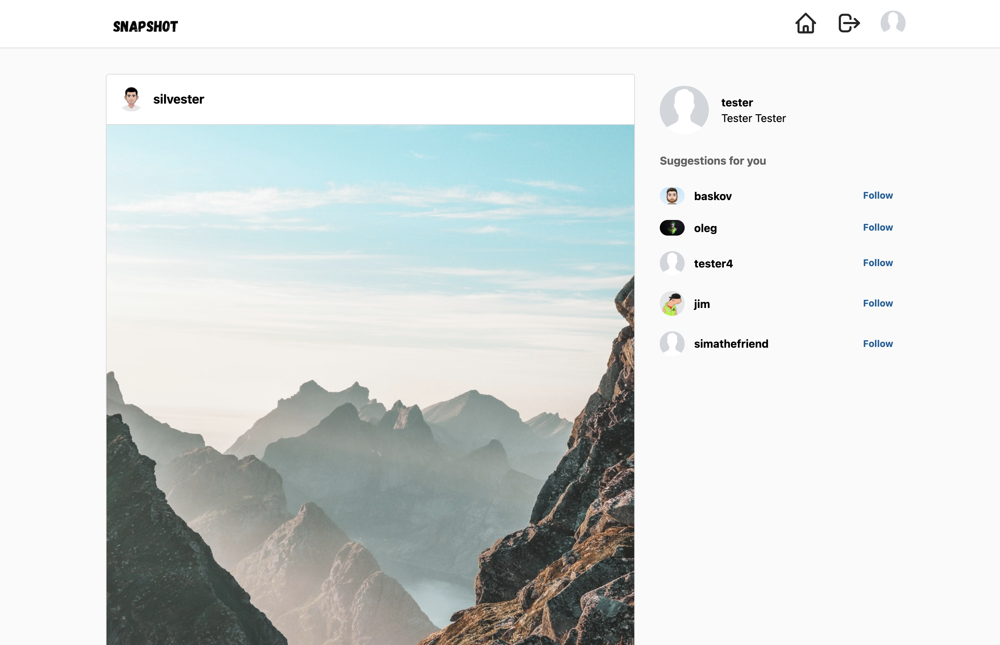

### SnapShot

## Introduction

The application was built with the purpose of improving my skills using React and other technologies I have not used before, including Firebase and @tailwindcss.

Live Demo at: [snapshot-three.vercel.app](https://snapshot-three.vercel.app/)

## Features

- Signin/signup
- Profile page 
- Timeline
- Suggestions
- Comment/like

## Technologies

The entire codebase consists in **Javascript**

Here is a list of technologies used:

- **React**: Front-end framework
- **Tailwind**: A utility-first CSS framework
- **Firebase**: Cloud database/auth provider

## Acknowledgments

This project is a clone of [Instagram by Facebook](https://www.instagram.com/) web application. This is just a demo application with no itent of commercial use or any advertising.
